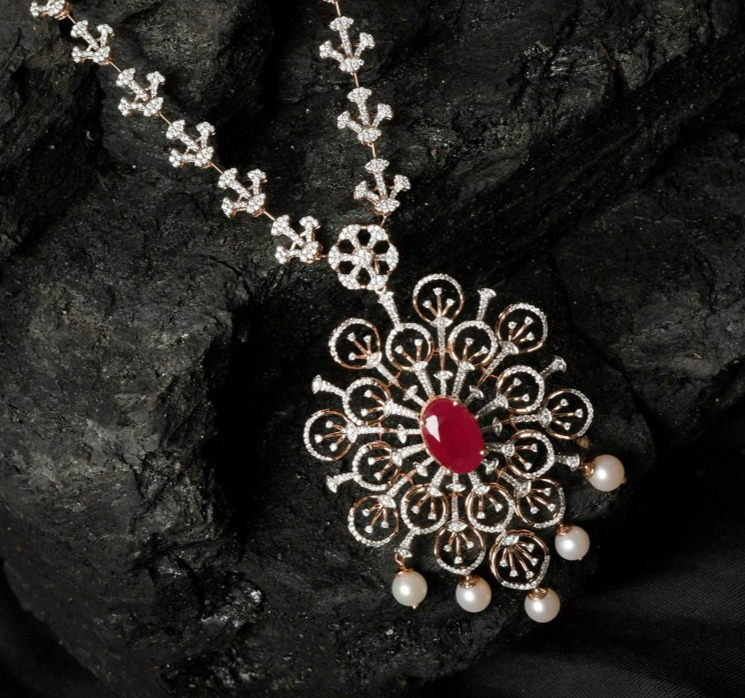

# Hero Section Implementation & Troubleshooting Guide

## ✅ Quick Checklist

- [ ] Images optimized to 150-250KB each
- [ ] Images are at least 1920x1080px resolution
- [ ] Images are in JPG or WebP format (not PNG)
- [ ] File names match: `1.jpg`, `2.jpg`, `3.jpg`
- [ ] Tested animations on desktop browser
- [ ] Tested animations on mobile device
- [ ] Navigation arrows are clickable and working
- [ ] Progress bars animate smoothly
- [ ] Buttons have hover effects
- [ ] Text animations stagger properly

---

## 📝 Implementation Steps

### Step 1: Prepare Your Images
```
Recommended workflow:
1. Choose your 3 best jewelry product images
2. Crop to 16:9 ratio (e.g., 1920x1080)
3. Optimize using Squoosh:
   - Format: WebP (70% quality)
   - Format: JPG fallback (75% quality)
4. Verify file size < 250KB
5. Name them: 1.jpg, 2.jpg, 3.jpg
6. Place in same folder as index.html
```

### Step 2: Update Image References
The current code looks for:
- `1.jpg` (First slide image)
- `2.jpg` (Second slide image)
- `3.jpg` (Third slide image)

If using different names, update in CSS:
```css
.slide:nth-child(1) .slide-bg { background-image: url('your-image-1.jpg'); }
.slide:nth-child(2) .slide-bg { background-image: url('your-image-2.jpg'); }
.slide:nth-child(3) .slide-bg { background-image: url('your-image-3.jpg'); }
```

### Step 3: Test Locally
```
1. Open index.html in web browser
2. Check each slide loads
3. Verify animations play
4. Test on mobile (F12 → Device Toolbar)
5. Check performance (DevTools → Lighthouse)
```

---

## 🐛 Troubleshooting

### Issue: Images not showing
**Possible causes**:
- Wrong file names (case-sensitive on servers)
- Wrong file path
- Files not in same directory
- Wrong image format

**Solution**:
```
1. Check file names match exactly
2. Verify path in CSS (background-image: url('1.jpg'))
3. Open DevTools (F12) → Network tab
4. Look for failed image downloads
5. Check file permissions
```

### Issue: Animations feel choppy/stuttering
**Possible causes**:
- Large, unoptimized images
- GPU acceleration disabled
- Too many simultaneous animations

**Solution**:
```
1. Optimize images more aggressively (50-60% quality)
2. Check DevTools Performance tab
3. Close other browser tabs
4. Try different browser (Chrome recommended)
5. Check "will-change" is applied correctly
```

### Issue: Progress bars not filling
**Possible causes**:
- CSS animation not applied
- JavaScript not resetting animation

**Solution**:
```
1. Open DevTools → Elements
2. Inspect .slide-bar.active
3. Check "animation" property shows "barFill 6s linear forwards"
4. Verify @keyframes barFill exists in CSS
5. Reload page (Ctrl+F5 to clear cache)
```

### Issue: Text animations not showing
**Possible causes**:
- Initial transforms not set
- JavaScript not calling resetSlideAnim()
- CSS transitions overridden

**Solution**:
```
1. Check .slide-tag, .slide-h1, etc. have opacity: 0 initially
2. Check .slide.active applied correctly
3. Verify no browser extensions blocking styles
4. Test in incognito mode
```

### Issue: Mobile looks different
**Expected**: Some adjustments for mobile are normal
**Acceptable differences**:
- Smaller font sizes
- Adjusted button sizes
- Different padding/margins
- Scroll indicator hidden on very small screens

**If something is broken**:
- Check responsive CSS media queries
- Test in actual phone browser (not just simulator)
- Check touch events in console for errors

---

## 🎨 Customization Guide

### Change Text Content
Edit the slide content in HTML:
```html
<div class="slide-tag">Your Tag Here</div>
<h1 class="slide-h1">Your Heading<br/><em>Emphasis</em></h1>
<p class="slide-p">Your description text here</p>
```

### Change Animation Timing
Edit delays in CSS (currently in milliseconds):
```css
/* Tag appears after 200ms */
.slide-tag { transition: ... .3s; }

/* Heading appears after 350ms */
.slide-h1 { transition: ... .5s; }

/* Description appears after 500ms */
.slide-p { transition: ... .7s; }

/* Buttons appear after 650ms */
.slide-btns { transition: ... .9s; }
```

### Change Colors
Edit CSS variables:
```css
:root {
  --gold: #YOUR_COLOR;
  --gold2: #YOUR_LIGHTER_COLOR;
  --g: #YOUR_DARK_COLOR;
}
```

### Change Button Styles
```css
.btn-solid {
  background: linear-gradient(135deg, YOUR_COLOR1 0%, YOUR_COLOR2 100%);
  padding: 14px 36px; /* Adjust padding */
}

.btn-ghost {
  border: 2px solid YOUR_COLOR;
}
```

### Change Image Zoom Effect
```css
.slide-bg {
  transform: scale(1.12); /* Default: 1.12 */
  /* Change to scale(1.15) for more zoom */
}
.slide.active .slide-bg {
  transform: scale(1); /* Zoom target */
}
```

### Change Slide Duration
```javascript
autoTimer = setInterval(() => {
  changeSlide(1);
}, 6000); // Currently 6 seconds, change to 8000 for 8 seconds
```

---

## 🚀 Performance Tips

### 1. Image Optimization
```
✓ Squoosh: squoosh.app (fast, browser-based)
✓ TinyPNG: tinypng.com (batch processing)
✓ ImageMagick: convert image.jpg -quality 75 image-optimized.jpg

Target: < 250KB per image
```

### 2. Check Lighthouse Score
```
1. Open DevTools → Lighthouse
2. Run audit on "Performance"
3. Aim for score > 85
4. Follow recommendations
```

### 3. Enable Caching
```html
<!-- Add to server config or .htaccess -->
Cache-Control: public, max-age=31536000
```

### 4. Consider WebP
```html
<picture>
  <source srcset="1.webp" type="image/webp">
  <source srcset="1.jpg" type="image/jpeg">
  
</picture>
```

---

## 🔍 Browser Compatibility

| Browser | Version | Status | Notes |
|---------|---------|--------|-------|
| Chrome | 90+ | ✅ Full support | Recommended |
| Edge | 90+ | ✅ Full support | Similar to Chrome |
| Firefox | 88+ | ✅ Full support | Slight animation difference |
| Safari | 14+ | ✅ Full support | May have subtle differences |
| Mobile Chrome | 90+ | ✅ Full support | Test on actual device |
| Mobile Safari | 14+ | ✅ Full support | iOS specific optimizations |

### Testing on Old Browsers
If you need to support older browsers:
```
1. Animations will not play (graceful fallback)
2. Images will still show
3. All functionality remains
4. No errors in console
```

---

## 💾 Backup Before Changes

```
1. Create a copy: index.html → index.html.backup
2. Make changes to index.html
3. Test thoroughly
4. If issues, restore from backup
```

---

## 🎯 Quality Assurance Checklist

### Visual Check
- [ ] No image distortion
- [ ] Text clearly readable over images
- [ ] Colors look correct
- [ ] Animations are smooth

### Functional Check
- [ ] All 3 slides work
- [ ] Navigation arrows functional
- [ ] Progress bars update
- [ ] Touch/swipe works on mobile
- [ ] Links in buttons work

### Performance Check
- [ ] Page loads in < 3 seconds
- [ ] No jank during animations
- [ ] Scroll is smooth
- [ ] No console errors

### Cross-browser Check
- [ ] Desktop Chrome ✓
- [ ] Desktop Firefox ✓
- [ ] Mobile Safari ✓
- [ ] Mobile Chrome ✓

---

## 📞 Common Questions

**Q: Can I use PNG images?**
A: Yes, but avoid large PNGs. They're larger than JPG. Use: JPG > WebP > PNG

**Q: Can I add more slides?**
A: Yes! Duplicate a slide div and update JavaScript `const TOTAL = 4;`

**Q: Can I change the animation speed?**
A: Yes! Update transition durations in CSS and autoTimer interval in JS

**Q: Will this work on older phones?**
A: Yes, with graceful degradation. Animations won't play but content shows.

**Q: Can I add video instead of images?**
A: Yes, but requires JavaScript changes. Contact developer if needed.

---

## 🎬 Final Notes

- This hero section is production-ready
- It's optimized for jewelry/luxury brands
- Animation times can be tweaked to match your brand pace
- Always test with real data before going live
- Monitor performance with Lighthouse regularly

**Good luck with your beautiful new hero section! 🌟**
